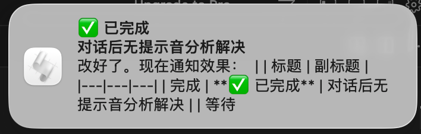
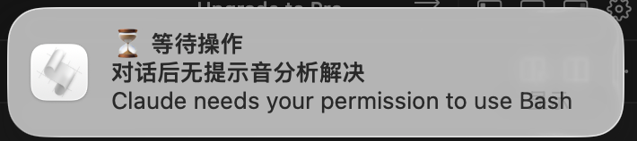

# Claude Code Notifier

macOS desktop notifications for [Claude Code](https://docs.anthropic.com/en/docs/claude-code). Know when Claude finishes or needs your attention — without watching the terminal.

<p align="center">
  
  &nbsp;&nbsp;
  
</p>

## Background

Claude Code is a terminal-based AI coding assistant. When you assign it a task, it runs autonomously — sometimes for seconds, sometimes for minutes.

**The problem:** There's no built-in way to know when Claude finishes or needs your input. You either stare at the terminal waiting, or context-switch and miss the moment Claude is done. Both waste your time.

**The solution:** This tool uses Claude Code's [Hooks](https://docs.anthropic.com/en/docs/claude-code/hooks) system to send macOS native desktop notifications with sound alerts. The notification subtitle shows an AI-generated session summary so you can tell *which* task finished at a glance — especially useful when running multiple sessions.

**The result:** You get a notification the instant Claude is done. Switch to another app, grab a coffee, work on something else — the notification will find you.

## Features

- **✅ 已完成** — Claude 回复完毕时弹出通知 + 提示音
- **⏳ 等待操作** — Claude 需要权限确认或等待输入时弹出通知 + 提示音
- **AI 会话摘要** — 自动调用 claude-3-haiku 将首条消息总结为 6 字短标题，一眼看出是哪个任务
- **本地 fallback** — 没有 API 时自动切换到本地关键词提取，不依赖网络
- **缓存机制** — 每个 session 只调一次 AI，后续通知瞬间触发

## Notification Events

This tool listens to 2 hook events. Claude Code supports more — you can extend it to cover others:

| Hook Event | Title | Sound | Description |
|---|---|---|---|
| `Stop` | ✅ 已完成 | Hero | Claude 完成回复，可以查看结果 |
| `Notification` | ⏳ 等待操作 | Sosumi | Claude 需要权限确认或等待用户输入 |

### All Available Claude Code Hook Events

You can add more events by editing `notify.py` and `~/.claude/settings.json`. Here's the full list of available hooks and suggested sounds:

| Hook Event | Description | Suggested Sound |
|---|---|---|
| `Stop` | Claude 完成回复 | Hero (triumphant) |
| `Notification` | 需要权限 / 等待输入 | Sosumi (alert) |
| `SubagentStop` | 子 agent 完成任务 | Ping (subtle) |
| `PreToolUse` | 工具调用前（如 Bash, Write） | Tink (light tap) |
| `PostToolUse` | 工具调用后 | Pop (quick) |
| `SessionStart` | 新会话开始 | Blow (start-up) |
| `PreCompact` | 上下文压缩前 | Submarine (low) |
| `UserPromptSubmit` | 用户提交输入 | — (usually silent) |

### macOS System Sounds Reference

All available sounds in `/System/Library/Sounds/`:

| Sound | Style | Best For |
|---|---|---|
| `Hero` | Triumphant, uplifting | Task completion |
| `Sosumi` | Classic Mac alert, distinctive | Attention needed |
| `Funk` | Short, punchy | Errors or warnings |
| `Basso` | Deep, serious | Critical errors |
| `Glass` | Gentle, clear | Subtle notifications |
| `Ping` | Quick, clean | Minor updates |
| `Pop` | Soft, bubbly | Tool completion |
| `Tink` | Light tap | Background events |
| `Blow` | Airy, soft | Session start |
| `Bottle` | Hollow, watery | Neutral events |
| `Frog` | Quirky croak | Fun/custom use |
| `Morse` | Rhythmic beep | Repeated events |
| `Purr` | Soft vibration | Gentle reminders |
| `Submarine` | Low sonar ping | System events |

## Requirements

- **macOS** (uses `osascript` for native notifications)
- **Python 3.6+**
- **Claude Code** installed and configured

## Installation

```bash
git clone https://github.com/yike-gunshi/claude-code-notifier.git
cd claude-code-notifier
bash install.sh
```

Restart Claude Code after installation.

### Optional: Enable AI Session Summary

Install the Anthropic Python SDK to enable AI-powered session name summaries:

```bash
pip install anthropic
```

The notifier will use your existing Claude Code API credentials (`ANTHROPIC_API_KEY` or `ANTHROPIC_AUTH_TOKEN`) automatically. If unavailable, it falls back to local keyword extraction.

## How It Works

```
Claude Code Hook (stdin JSON)
        │
        ▼
   notify.sh (entry point)
        │
        ▼
   notify.py
        │
        ├── Read session transcript
        │       │
        │       ▼
        ├── AI Summary (claude-3-haiku)
        │   or Local keyword extraction
        │       │
        │       ▼
        ├── Cache summary (~/.cache/claude-code-notifier/)
        │
        ▼
   macOS Notification + Sound
```

1. Claude Code triggers the hook with JSON via stdin (contains `session_id`, `transcript_path`, `last_assistant_message`, etc.)
2. The script reads the first user message from the session transcript
3. Generates a short summary (AI or local fallback) and caches it per session
4. Sends a macOS native notification with the summary as subtitle

## Configuration

### Change Notification Sounds

Edit `notify.py` and modify the `sound` values in the `main()` function.

### Manual Hook Configuration

If you prefer to configure hooks manually, add this to `~/.claude/settings.json`:

```json
{
  "hooks": {
    "Stop": [
      {
        "hooks": [
          { "command": "/path/to/claude-code-notifier/notify.sh", "type": "command" }
        ],
        "matcher": ".*"
      }
    ],
    "Notification": [
      {
        "hooks": [
          { "command": "/path/to/claude-code-notifier/notify.sh", "type": "command" }
        ],
        "matcher": ".*"
      }
    ]
  }
}
```

## Uninstall

```bash
cd claude-code-notifier
bash uninstall.sh
```

## Related Projects

If you need more advanced audio hooks or cross-platform support, check out these projects:

- [ctoth/claudio](https://github.com/ctoth/claudio) — Go-based audio plugin with soundpacks and contextual sounds per tool event (54 stars)
- [wyattjoh/claude-code-notification](https://github.com/wyattjoh/claude-code-notification) — Lightweight macOS notification hook with customizable sounds (51 stars)
- [shanraisshan/claude-code-voice-hooks](https://github.com/shanraisshan/claude-code-voice-hooks) — Ding/dong sounds on tool use events (43 stars)
- [farouqaldori/claude-island](https://github.com/farouqaldori/claude-island) — macOS menu bar session manager with notifications (727 stars)
- [soulee-dev/claude-code-notify-powershell](https://github.com/soulee-dev/claude-code-notify-powershell) — Windows PowerShell toast notifications (58 stars)

## License

MIT
